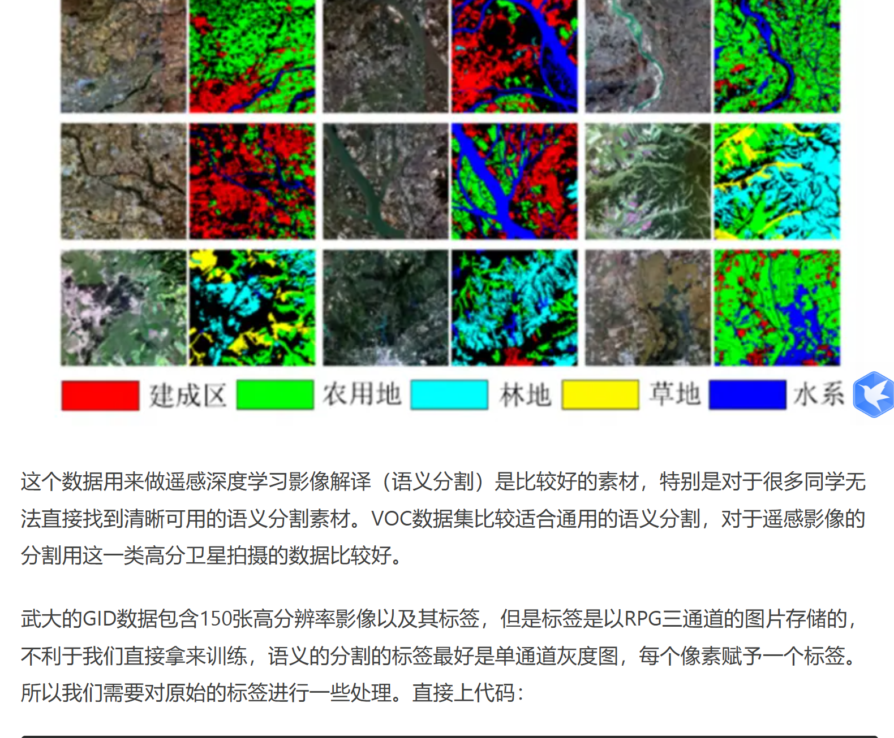

# LOVEwd

## classes去掉grass：9（暂不知道原因）
```
    # Total class: 10 ('Background':0, 'Building-flooded':1, 'Building-non-flooded':2, 'Road-flooded':3, 'Road-non-flooded':4, 'Water':5, 'Tree':6, 'Vehicle':7, 'Pool':8).
```
## 像素点的值与数量。

| Key | Value |
|-----|-------|
| 0   | 163415419 |
| 1   | 110326677 |
| 2   | 209899042 |
| 3   | 157610916 |
| 4   | 429103412 |
| 5   | 814890623 |
| 6   | 1316258879 |
| 7   | 12436766 |
| 8   | 13086670 |


