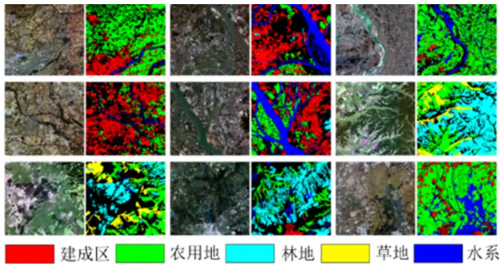

# LOVEwd
## 数据集大小
The LoveDA
 contains 5987 HSR images with 166768 annotated objects from Nanjing, Changzhou and Wuhan cities. 
 
 There are 2713 images for urban scenes and 3274 images for rural scenes.


## 灰度图的像素点
```
no-data regions - 0
background – 1, 
building – 2, red
road – 3,
water – 4, dark blue
barren – 5, yellow
forest – 6, cyan
agriculture – 7. green
```


