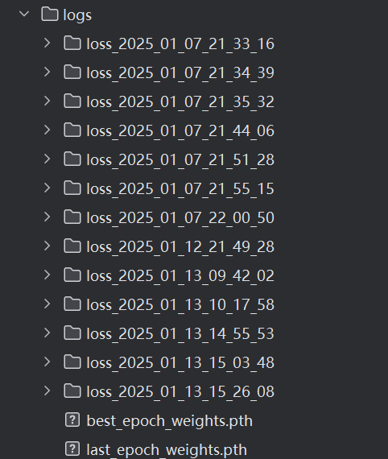
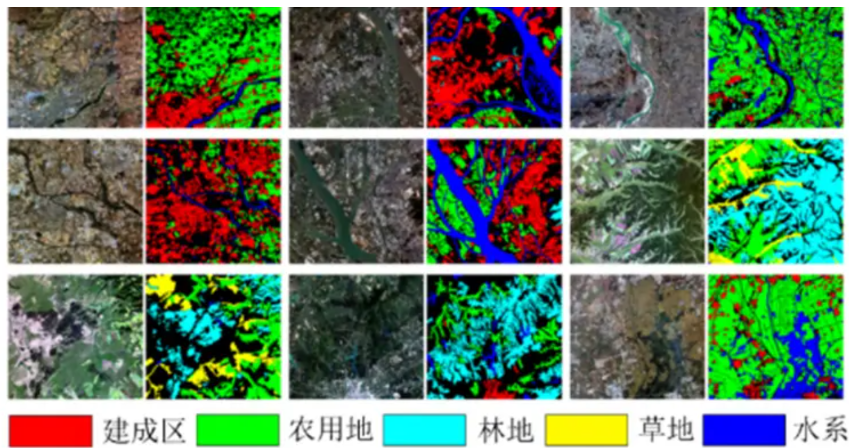
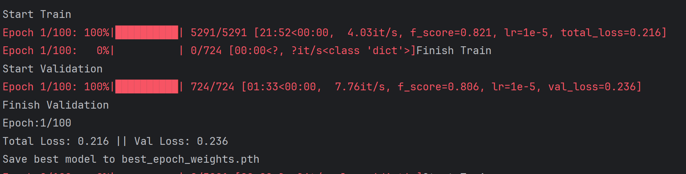
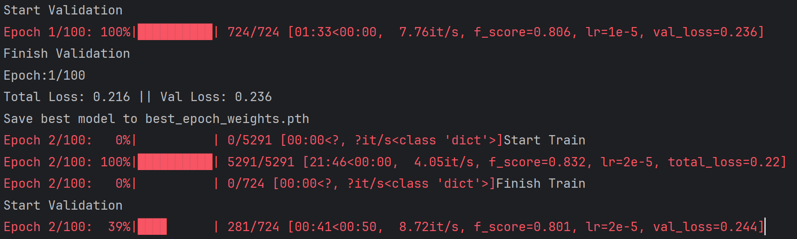
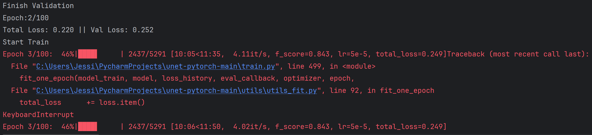
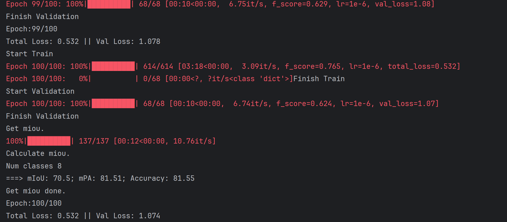

# 1st
  
## 25/1/13/16：01运行前的权值文件    

ep100-loss0.532-val_loss1.074.pth
  
## 分类
| Key | Value |
|-----|-------|
| 0   | 163415419 |
| 1   | 110326677 |
| 2   | 209899042 |
| 3   | 157610916 |
| 4   | 429103412 |
| 5   | 814890623 |
| 6   | 1316258879 |
| 7   | 12436766 |
| 8   | 13086670 |

## 数据集（仅含rural的1366照片）


  
## 效果图



  
## 控制台
### epoch 1 成功

### start validation


### finished

  
## 分析

```
Error: syntax error in line 1 near '这些数值表明模型的性能处于中等偏上的水平，以下是具体分析：'
```  

  